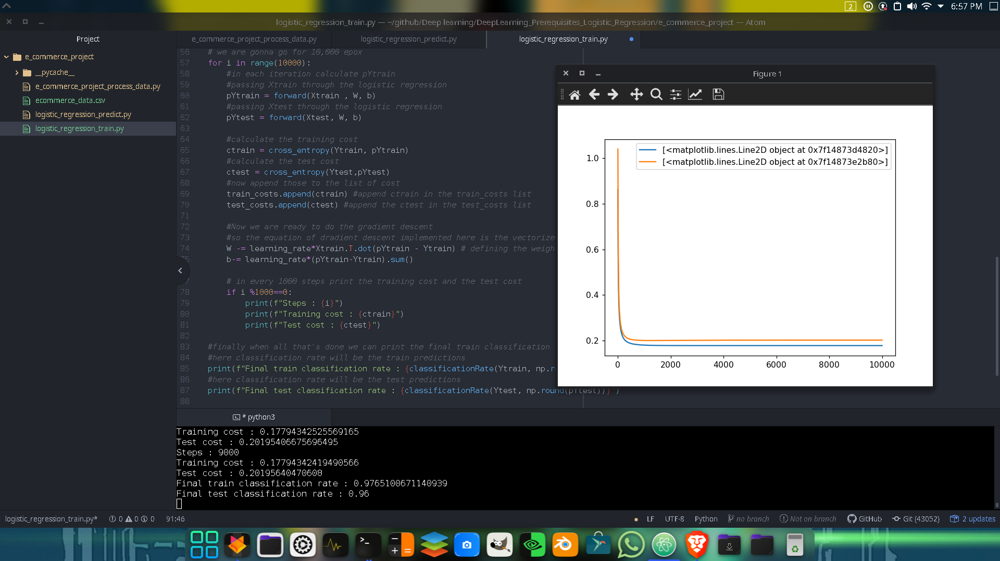

# e commerce ML project
## This is a Machine learning project that uses Logistic regression model to predict the user actions on our e-commerce website
### For example :-
#### If the user is gonna -> bounce (Exit the website), not completing the checkout after adding the product into his/her cart etc.
#### Here I am only going to do binary classification meaning we will only be focusing on (bounce and add_to_cart) instead of all the classes (bounce/add_to_card/begin_checkout/finish_checkout)

